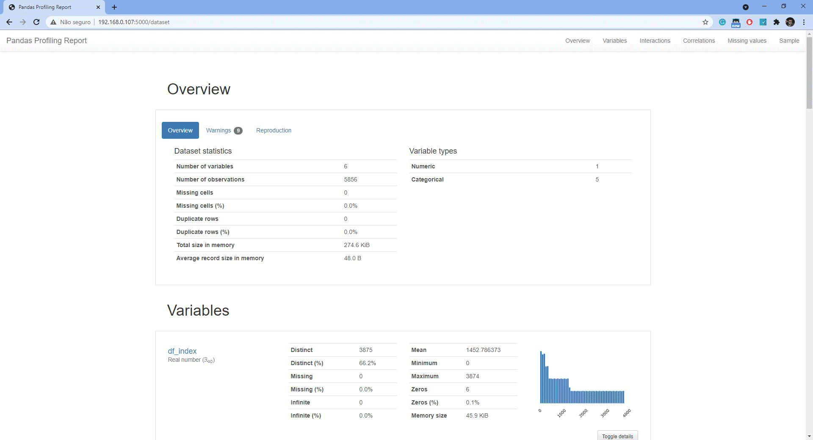

# Pneumonia Detector (X-Ray)
This project is the final project of my specialization in Data Science, Which used the CNN to classify chest X-ray image between healthy and pneumonia. The Model is provided in a web application where you can upload an X-Ray Image from a chest, and then receive the classification/analyzes. The whole project is a acamedic approach and should not be used by a docker or similiar person in a hospital for example.

<br />

## Dataset


- Source: This dataset was taken from the Kaggle platform posted here in this [link](https://www.kaggle.com/paultimothymooney/chest-xray-pneumonia).

# Approach/Introduction


For this approach, I'm using CNN to identify the disease (Pneumonia). Before providing the image to the CNN must be processed to just provide in the image the chest part of the image. In the folder **models**, there are some Convolutional Neural Networks that were tested to be used in the solution. It's used in Grayscale to feed and train the CNN.


In deep learning, a convolutional neural network (CNN, or ConvNet) is a class of deep neural networks, most commonly applied to analyzing visual imagery. For more information click [here](https://en.wikipedia.org/wiki/Convolutional_neural_network).


X-rays are a type of radiation called electromagnetic waves. X-ray imaging creates pictures of the inside of your body. The images show the parts of your body in different shades of black and white. For more information click [here](https://en.wikipedia.org/wiki/X-ray).
<br />


# Application
It was developed as a web application to select the X-ray images and predict them as well as train the model. You can select your X-ray image to apply and then the model will return the probability, class and explanation.
<br />

## Getting starting 

Can be used in the Dockerfile to build the environment to run the application. Also is possible to pull the container from [Dockerhub](https://hub.docker.com/r/mamcarujo/pneumonia-detector). The second option is executing directly the application inside the directory [**app**](https://github.com/mcarujo/pneumonia-detector/tree/develop/app).


<br />


### Docker

#### Building - Building the image in your machine.
```bash
docker build -t mamcarujo/pneumonia-detector .
```

#### Pulling - Pulling the image in your machine.
```
docker pull mamcarujo/pneumonia-detector
```

#### Running - Can be run the container using the following command.
```
docker run -p 80:5000 mamcarujo/pneumonia-detector
```

### Python

Inside the folder **app** run the following command to start the API. For more information of how to run a Flask application just check [here](https://flask.palletsprojects.com/en/1.1.x/quickstart/).

```
flask run
```

<br />


### User Interface
<br />
<br />


