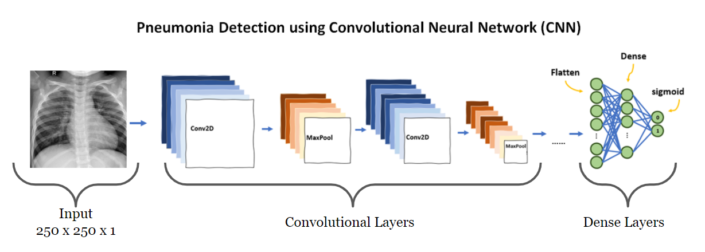
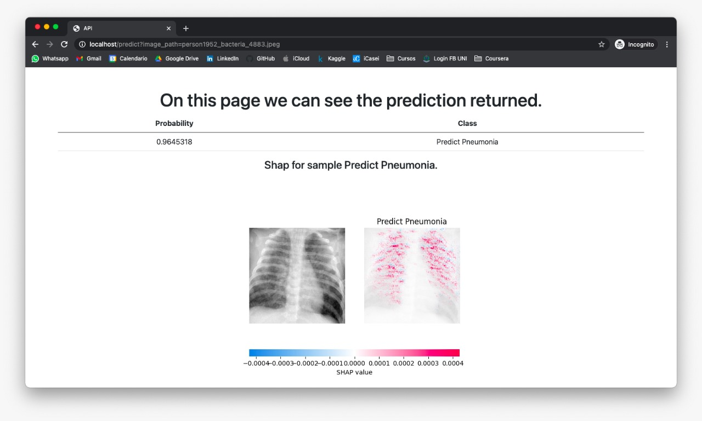

# Pneumonia Detector (X-Ray)
This project is the final project of my specialization in Data Science.

Using the CNN to classify chest X-ray image between healthy and pneumonia.
 

# Dataset

### Source
##### This dataset was taken from the Kaggle platform posted here in this [link](https://www.kaggle.com/paultimothymooney/chest-xray-pneumonia).

### Information
The dataset is organized into 3 folders (train, test, val) and contains subfolders for each image category (Pneumonia/Normal). There are 5,863 X-Ray images (JPEG) and 2 categories (Pneumonia/Normal).

Chest X-ray images (anterior-posterior) were selected from retrospective cohorts of pediatric patients of one to five years old from Guangzhou Women and Children’s Medical Center, Guangzhou. All chest X-ray imaging was performed as part of patients’ routine clinical care.

For the analysis of chest x-ray images, all chest radiographs were initially screened for quality control by removing all low quality or unreadable scans. The diagnoses for the images were then graded by two expert physicians before being cleared for training the AI system. In order to account for any grading errors, the evaluation set was also checked by a third expert.

# Approach

For this approach, I'm using CNN to identify the disease (Pneumonia). Before providing the image to the CNN must be processed to just provide in the image the chest part of the image. In the folder **models** there are some Convolutional Neural Network that was tested for be used in the solution. It's used the image in Grayscale to feed and train the CNN.

In deep learning, a convolutional neural network (CNN, or ConvNet) is a class of deep neural networks, most commonly applied to analyzing visual imagery. They are also known as shift invariant or space invariant artificial neural networks (SIANN), based on the shared-weight architecture of the convolution kernels that shift over input features and provide translation equivariant responses. Counter-intuitively, most convolutional neural networks are only equivariant, as opposed to invariant, to translation. [Source - CNN](https://en.wikipedia.org/wiki/Convolutional_neural_network)

An X-ray, or X-radiation, is a penetrating form of high-energy electromagnetic radiation. Most X-rays have a wavelength ranging from 10 picometers to 10 nanometers, corresponding to frequencies in the range 30 petahertz to 30 exahertz (30×1015 Hz to 30×1018 Hz) and energies in the range 124 eV to 124 keV. X-ray wavelengths are shorter than those of UV rays and typically longer than those of gamma rays. [Source - X-ray](https://en.wikipedia.org/wiki/X-ray)

# Application

It's was developed a web application to be possible select the X-ray images and predict them as well train the model.

