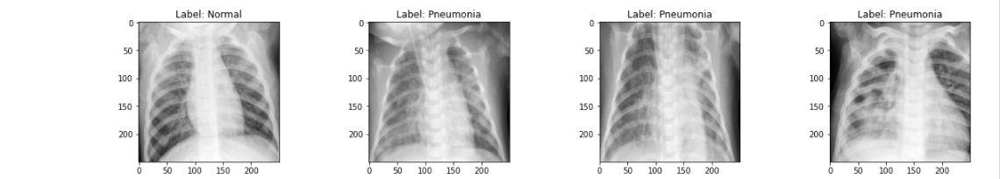

# Dataset

## Sources 
- This dataset was taken from the Kaggle platform posted here in this [link](https://www.kaggle.com/paultimothymooney/chest-xray-pneumonia).

Also, you can add more dataset to improve the Deep Learning model, there are many datasets similar in the Kaggle that combine can create a huge base of knowledge for this application. Although the focus here is to create a Proof of Concept (POC).

## Information
- There are 2 main folders:
    - raw -> Images not processed, in original format;
    - transformed -> Images processed, in format 250, 250, 1 (Gray);

The dataset is organized into 3 folders (train, test, val) and contains subfolders for each image category (Pneumonia/Normal). 

If it's necessary to add more images to the dataset just add the images to the raw folder.

## Folders & Files

- **raw** contains the images in original format;
- **transformed** contains the images in processed format;
- **data_image.csv** is the CSV that contains all path and information from the images;
- **Data_Transformation_and_Firebase.ipynb** contains the image processing and firebase upload as a notebook;
- **data_transformation_and_firebase.py** contains the image processing and firebase upload as a script;
- **EDA_and_DatasetCSV.ipynb** contains a short EDA process and how is generated the data_image.csv;
- **firebase_env.py** the firebase credentials;
- **helpers.py** this file just to save some functions to help keep the notebooks clean;